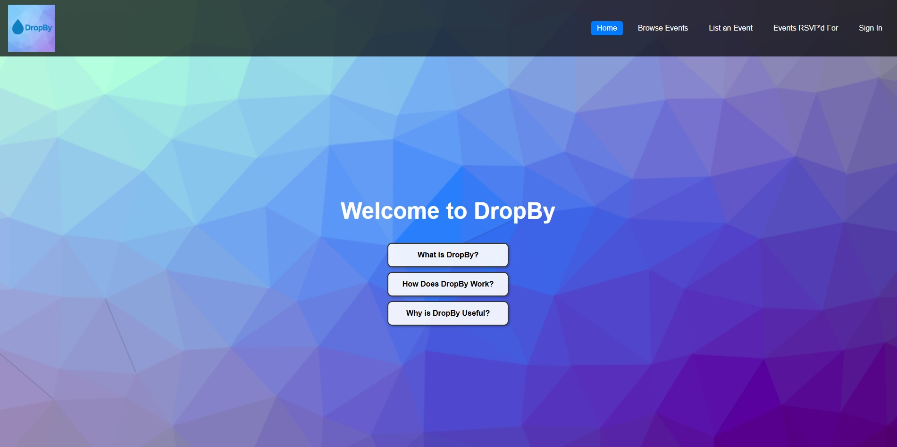
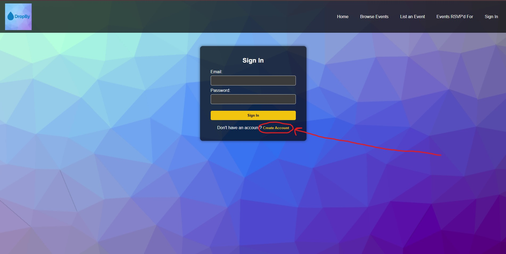
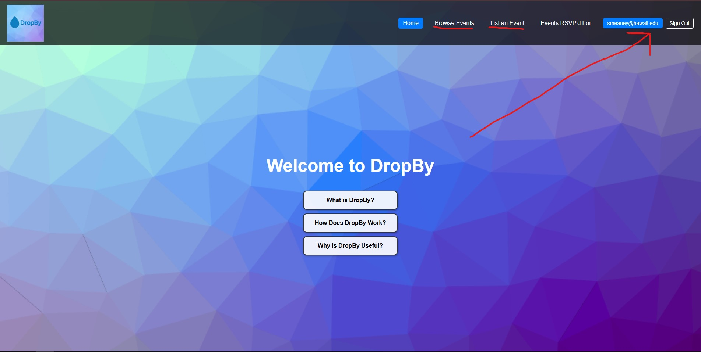
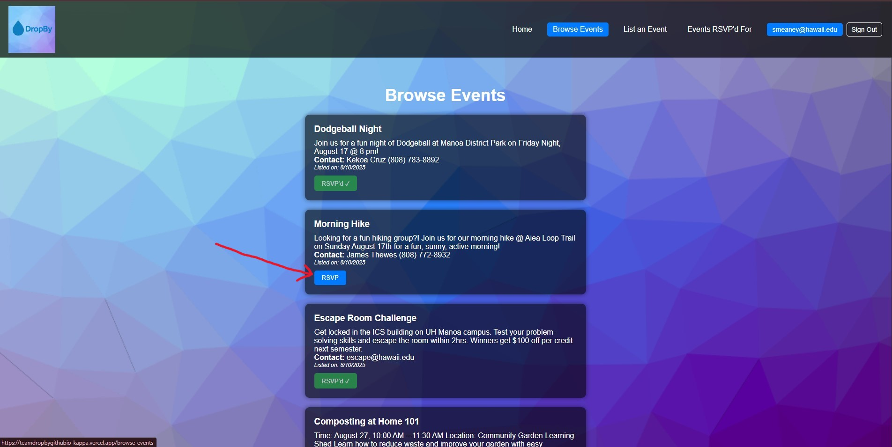
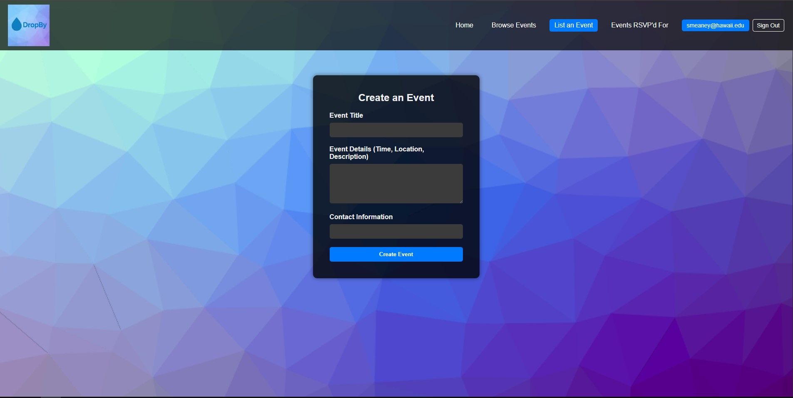

# DropBy

**DropBy** is a web application designed to help people discover and share local events happening in their community. Whether it's a pickup volleyball game, a car meet, a church gathering, or a casual hangout — DropBy lets you find what’s happening nearby and connect with others who plan to attend.

---

## Table of Contents

- [Project Goals](#project-goals)
- [Planned Features](#planned-features)
- [Mockups](#mockups)
- [Deployment](#deployment)
- [GitHub & Project Boards](#github--project-boards)
- [Team Contract](#team-contract)
- [Development Info](#development-info)
- [Team Members](#team-members)

---

## Project Goals

- Make local events easier to find and join
- Enable users to create and manage events
- Support filtering events by category (e.g., Sports, Social, Faith)
- Allow users to subscribe to other users/pages to get notified when new events are posted
- Deliver a clean, responsive, and intuitive UI

---

## Planned Features

- Browse all upcoming events
- Create new events with title, date, location, category, and description
- RSVP to events and track attendance
- Filter events by category or search by keyword
- Subscribe to other users/pages to receive notifications
- *(Stretch goal)* Leave reviews or feedback after attending an event
- *(Stretch goal)* Export events to Google Calendar

---

## Mockups

  
*This wireframe outlines the layout of the key pages in DropBy, including the Landing, Profile, Login, Event Creation, and RSVP pages.*

---

## Deployment

[Visit DropBy on Vercel](https://teamdropbygithubio-kappa.vercel.app/)
The live DropBy application is hosted on Vercel:  

*Current home page layout for the deployed site.*

---

## GitHub & Project Boards

- 🔗 [GitHub Organization](https://github.com/teamdropby)
- ✅ [Milestone 1 Project Board](https://github.com/orgs/teamdropby/projects/1)
- ✅ [Milestone 2 Project Board](https://github.com/orgs/teamdropby/projects/3)
- ⏭️ [Milestone 3 Project Board](https://github.com/orgs/TeamDropBy/projects/4)

---

## Team Contract

📄 [View Team Contract](docs/team-contract.pdf) 

---

## Development Info

- Built with HTML, CSS, TypeScript, and JavaScript
- VSCode as the development IDE
- GitHub Project Board for task and milestone tracking
- ESLint and Prettier for coding standards and consistency

---

## Team Members

- Elijah Brandner
- Shane Meaney	
- Koalani Okada
- Jane Davis

---

## User Guide

-First when landing on our websites homepage you will be greeted with some FAQ's,
you can either click on the FAQ's to learn more, or you can create an account.  

-To create an account you will have to navigate to our sign in page in the top right
of our landing page where it says to sign in, when you are on that page you will see
a sign in dialog, look under and you will see a create an account link, this will be
for people who do not have an account yet.

-Once signed in you will see your username/email in the top right with the option to
sign out, and you have access to start RSVP'ing for our events that are listed, or
you are even welcome to create your own events on our List an Event page by filling out
the required information on that page. To RSVP for an Event you will navigate to the
Browse Events page and click on the blue RSVP button on the event you want to attend.

-All events that you have RSVP'd for you will be able to see on our Events RSVP'd for
page in the nav bar as well.

---

## User Feedback

### Review 1: “Finally, an app that’s not overwhelming.”
I love how clean and simple DropBy is. I just want to find out what’s happening near me without scrolling through endless posts or ads — and this does exactly that. RSVPing is fast, and I’ve actually been discovering more community events than ever.

### Review 2: “DropBy made hosting my first event so easy.”
I’m not tech-savvy, but creating an event on DropBy was super straightforward. I added a few key details, and that’s all it needed. People started RSVP’ing quickly, and I didn’t have to deal with clunky tools or long setup steps. Highly recommend it for anyone organizing local get-togethers.

### Review 3: “This is how local events should work.”
DropBy cuts out the noise. Whether it’s a pop-up market or a live poetry night, I can actually find events I care about without being bombarded by unrelated content. It’s clean, focused, and built for people who want to be part of their community.

### Review 4: “It’s fast, it’s useful, and it just works.”
I don’t have time to dig through social media to find cool events. DropBy shows me what’s happening, where, and when — nothing more, nothing less. I love that. The RSVP system is clear and quick, and I’ve already gone to three events I wouldn’t have known about otherwise.

### Review 5: “Minimal design, maximum value.”
What I appreciate most about DropBy is its simplicity. It doesn’t try to be everything. It just helps you find and attend events — and that’s refreshing. No annoying pop-ups, no complicated feeds. Just useful info, presented well. It’s now one of my go-to apps.

### Review 6: “It’s not bad at all!”
It does its purpose and makes it simple instead of doing too much.

---

This project is part of the ICS 314 Software Engineering Final Project at UH Mānoa, Summer 2025.

Published with GitHub Pages.
