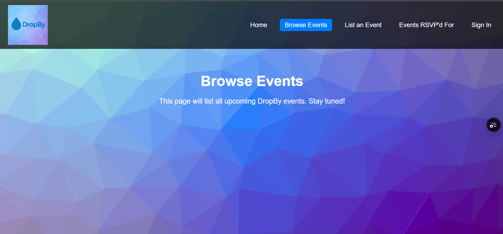
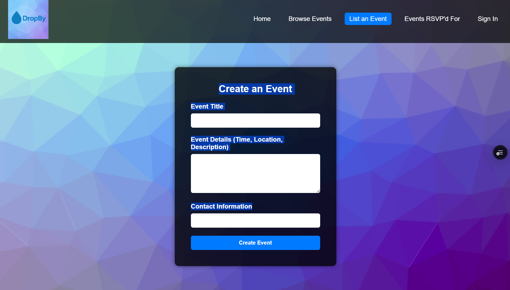
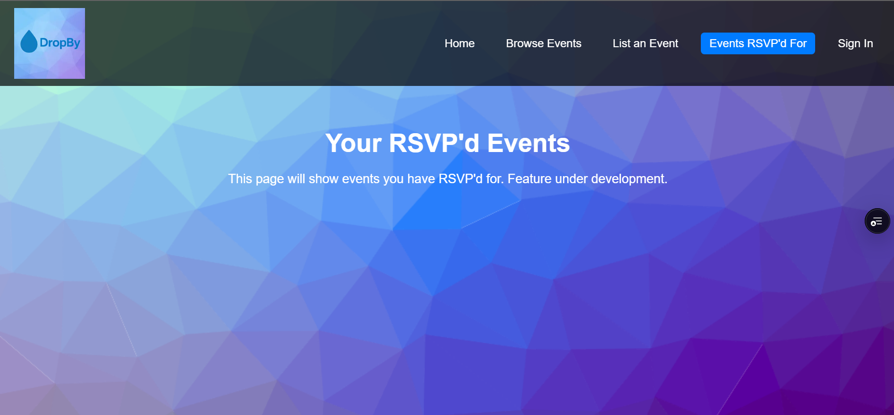
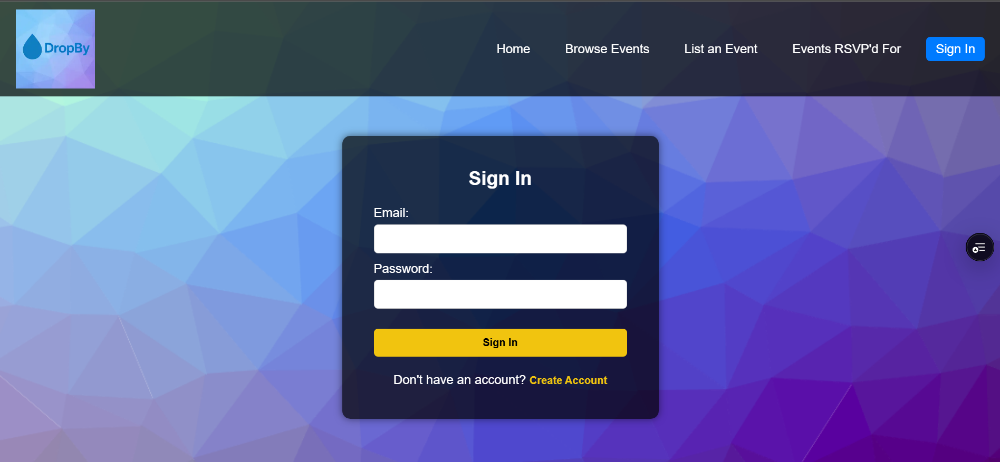
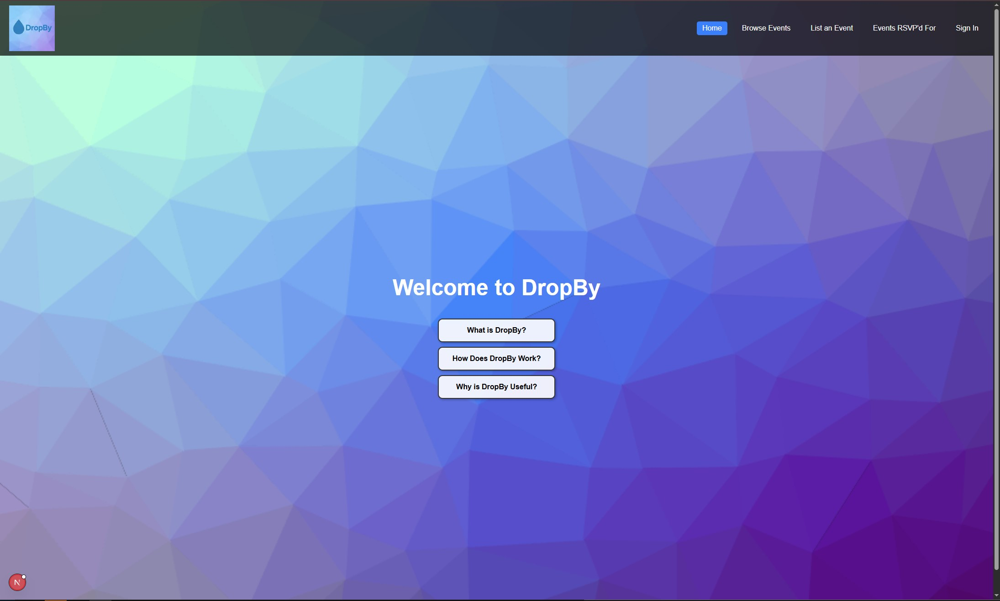

# DropBy

**DropBy** is a web application designed to help people discover and share local events happening in their community. Whether it's a pickup volleyball game, a car meet, a church gathering, or a casual hangout — DropBy lets you find what’s happening nearby and connect with others who plan to attend.

---

## Table of Contents

- [Project Goals](#project-goals)
- [Planned Features](#planned-features)
- [Mockups](#mockups)
- [Deployment](#deployment)
- [GitHub & Project Boards](#github--project-boards)
- [Team Contract](#team-contract)
- [Development Info](#development-info)
- [Team Members](#team-members)

---

## Project Goals

- Make local events easier to find and join
- Enable users to create and manage events
- Support filtering events by category (e.g., Sports, Social, Faith)
- Allow users to subscribe to other users/pages to get notified when new events are posted
- Deliver a clean, responsive, and intuitive UI

---

## Planned Features

- Browse all upcoming events
- Create new events with title, date, location, category, and description
- RSVP to events and track attendance
- Filter events by category or search by keyword
- Subscribe to other users/pages to receive notifications
- *(Stretch goal)* Leave reviews or feedback after attending an event
- *(Stretch goal)* Export events to Google Calendar

---

## Mockups

  
*This wireframe outlines the layout of the key pages in DropBy, including the Landing, Profile, Login, Event Creation, and RSVP pages.*

---

## Deployment

[Visit DropBy on Vercel](https://teamdropby-github-io-9smf-n1g6dbi7u-koas-projects-92f9d416.vercel.app) 
The live DropBy application is hosted on Vercel:  

*Current home page layout for the deployed site.*

---

## GitHub & Project Boards

- 🔗 [GitHub Organization](https://github.com/teamdropby)
- ✅ [Milestone 1 Project Board](https://github.com/orgs/teamdropby/projects/1)
- ⏭️ [Milestone 2 Project Board](https://github.com/orgs/teamdropby/projects/3)

---

## Team Contract

📄 [View Team Contract](docs/team-contract.pdf) 

---

## Development Info

- Built with HTML, CSS, TypeScript, and JavaScript
- VSCode as the development IDE
- GitHub Project Board for task and milestone tracking
- ESLint and Prettier for coding standards and consistency

---

## Team Members

- Elijah Brandner
- Shane Meaney	
- Koalani Okada
- Jane Davis

---

This project is part of the ICS 314 Software Engineering Final Project at UH Mānoa, Summer 2025.

Published with GitHub Pages.
